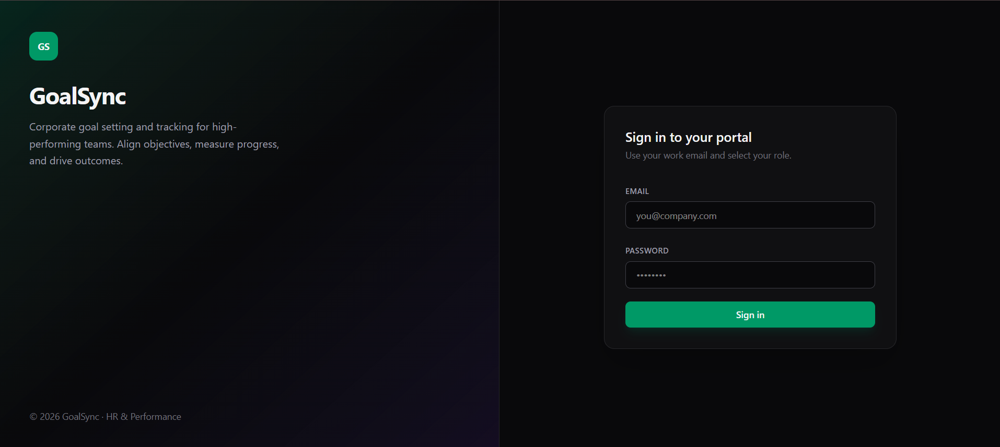
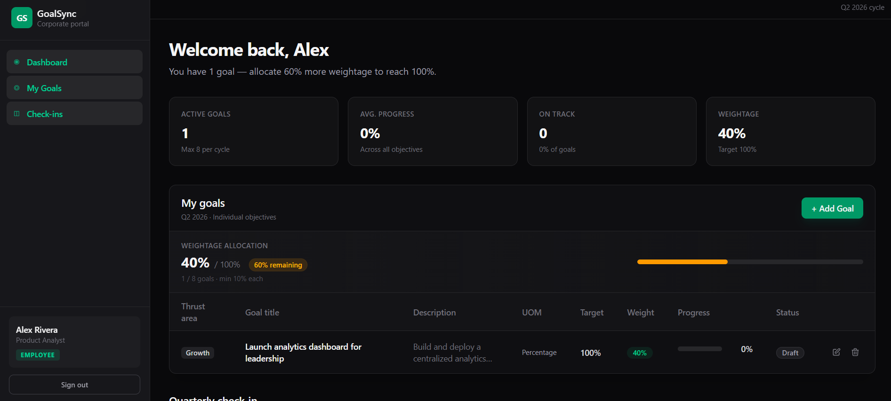
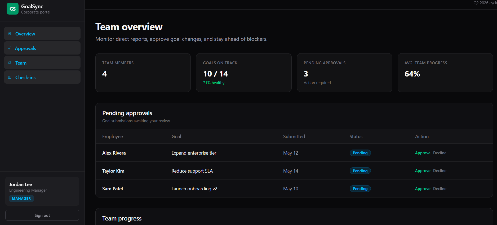
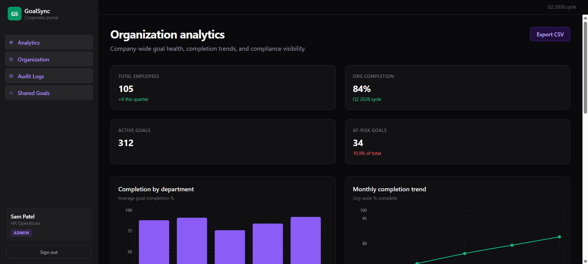
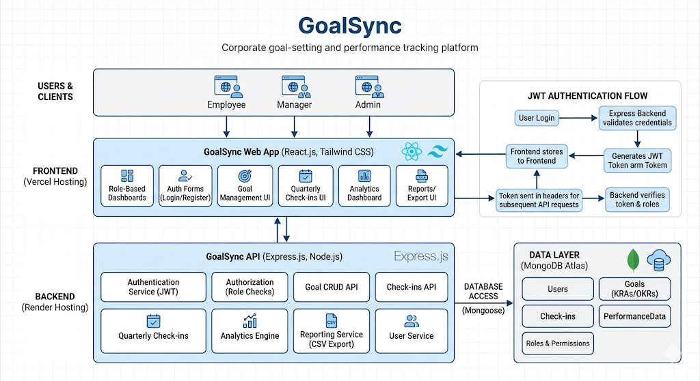
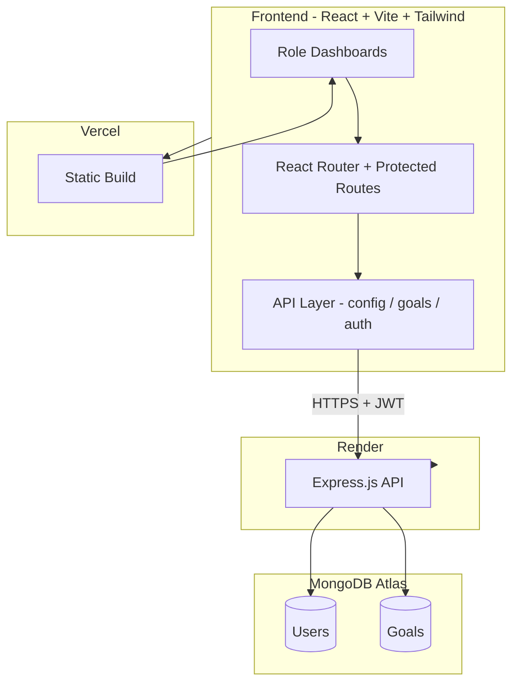

# GoalSync


**Align goals. Track progress. Drive performance.**

GoalSync is a corporate goal-setting and performance tracking platform built for hackathon-scale teams and enterprise-style workflows. It gives employees a structured way to define objectives, helps managers monitor team health, and equips administrators with organization-wide visibility and reporting.

---

## Problem Statement

Organizations struggle to keep individual goals aligned with company priorities. Spreadsheets and ad-hoc check-ins create fragmented data, weak accountability, and limited visibility for leadership. GoalSync centralizes the goal lifecycle-definition, weightage allocation, progress updates, quarterly check-ins, and admin reporting—in one role-aware application.

---

## Features

- **JWT authentication** with secure, role-based access
- **Employee goal management** - create, edit, delete, and track progress with validation rules
- **Weightage governance** - up to 8 goals per cycle, minimum 10% per goal, 100% total allocation
- **Quarterly check-ins** - achievement vs. plan, progress sliders, status updates, manager comments
- **Manager team view** - approvals queue, team progress, check-in cards, planned vs. actual
- **Admin analytics** - charts, audit-style activity, shared goals, CSV export for reporting
- **Protected routes** - unauthenticated users are redirected; cross-role access is blocked
- **Production-ready API layer** - environment-based backend URL configuration

---

## Role-Based Functionality

### Employee (`/employee`)

- Create and manage personal goals (thrust area, title, description, UOM, target, weightage)
- Real-time weightage summary and validation feedback
- Update progress via sliders with status badges
- Submit quarterly check-ins (actual achievement, progress %, status)
- View manager feedback on check-in records

### Manager (`/manager`)

- Team overview with stat cards and progress indicators
- Pending goal approvals workflow
- Team progress table with status badges
- Quarterly check-ins: filter by employee, compare planned vs. actual, post comments
- Achievement tracking table across direct reports

### Admin (`/admin`)

- Organization analytics dashboard (completion trends, status distribution, KPI cards)
- Audit log and shared company goals sections
- **Export CSV** - download `goals-report-YYYY-MM-DD.csv` from live goal data
- Full read access to organizational goal records via API

---

## Screenshots

### Login Portal


### Employee Dashboard


### Manager Dashboard


### Admin Dashboard


### System Architecture


---

## Architecture Overview



**Request flow**

1. User signs in → `POST /api/auth/login` → JWT + user profile stored in `localStorage`
2. Protected routes verify token and role before rendering dashboards
3. CRUD operations on goals use REST endpoints; UI updates optimistically where applicable
4. Admin CSV export fetches all goals and generates the file client-side

---

## Tech Stack

| Layer | Technology |
|-------|------------|
| Frontend | React 19, Vite, Tailwind CSS 4, React Router, Recharts |
| Backend | Node.js, Express.js 5 |
| Database | MongoDB Atlas, Mongoose |
| Auth | JWT, bcryptjs |
| Frontend hosting | Vercel |
| Backend hosting | Render |

---

## Project Structure

```
AtomBerg Hackathon/
├── goalsync-frontend/     # React SPA
│   ├── src/
│   │   ├── api/             # config, auth, goals, http helpers
│   │   ├── components/      # UI, check-in, employee modules
│   │   ├── context/         # Check-in shared state
│   │   ├── lib/             # validation, CSV export, auth storage
│   │   └── pages/           # Login, Employee, Manager, Admin dashboards
│   └── .env.example
├── goalsync-backend/        # Express API
│   ├── controllers/
│   ├── models/
│   ├── routes/
│   ├── seed.js              # Demo users
│   └── server.js
└── README.md
```

---

## Setup Instructions

### Prerequisites

- **Node.js** 18+ and npm
- **MongoDB Atlas** cluster (connection string)
- Git

### 1. Clone the repository

```bash
git clone https://github.com/DevanshiArora1/GoalSync.git
cd "AtomBerg Hackathon"
```

### 2. Backend setup

```bash
cd goalsync-backend
npm install
```

Create `goalsync-backend/.env`:

```env
PORT=5000
MONGO_URI=your_mongodb_atlas_connection_string
JWT_SECRET=your_secure_random_secret
```

Seed demo users (optional, resets users collection):

```bash
node seed.js
```

Start the API:

```bash
npm run dev
```

API runs at `http://127.0.0.1:5000` by default.

### 3. Frontend setup

```bash
cd ../goalsync-frontend
npm install
```

Copy environment file and point to your API:

```bash
cp .env.example .env.development
```

For local development, `.env.development` should contain:

```env
VITE_API_URL=http://127.0.0.1:5000
```

Start the dev server:

```bash
npm run dev
```

Open the URL shown in the terminal (typically `http://localhost:5173`).

### 4. Production build (frontend)

```bash
npm run build
npm run preview
```

Set `VITE_API_URL` to your Render backend URL before building for production.

---

## Environment Variables

### Backend (`goalsync-backend/.env`)

| Variable | Description |
|----------|-------------|
| `PORT` | Server port (default `5000`) |
| `MONGO_URI` | MongoDB Atlas connection string |
| `JWT_SECRET` | Secret key for signing JWT tokens |

### Frontend (`goalsync-frontend`)

| Variable | Description |
|----------|-------------|
| `VITE_API_URL` | Backend origin without trailing slash (e.g. `http://127.0.0.1:5000` or your Render URL) |

See `goalsync-frontend/.env.example` for a documented template.

---

## Deployment

| Service | Platform | URL |
|---------|----------|-----|
| Frontend | Vercel | https://goal-sync-kappa.vercel.app/ |
| Backend API | Render | https://goalsync-backend-o23v.onrender.com |

**Deployment checklist**

1. Deploy backend to **Render** with `MONGO_URI`, `JWT_SECRET`, and `PORT`
2. Set **Vercel** environment variable `VITE_API_URL` to the Render API origin
3. Enable CORS on the backend (already configured via `cors` middleware)
4. Run `node seed.js` once against production DB if demo accounts are needed
5. Build and deploy the frontend (`npm run build`)

---

## Test Credentials

After running `seed.js`, use these accounts:

| Role | Email | Password |
|------|-------|----------|
| Employee | `employee@test.com` | `123456` |
| Manager | `manager@test.com` | `123456` |
| Admin | `admin@test.com` | `123456` |

---

Use the deployed frontend link and the following demo credentials to explore each role-based journey.


## API Endpoints

| Method | Endpoint | Description |
|--------|----------|-------------|
| `POST` | `/api/auth/login` | Authenticate user, returns JWT |
| `GET` | `/api/goals` | List all goals (populated with employee name) |
| `POST` | `/api/goals` | Create a goal |
| `PUT` | `/api/goals/:id` | Update a goal |
| `DELETE` | `/api/goals/:id` | Delete a goal |

---

## Future Scope

- Manager approval actions persisted to the database
- Email / in-app notifications for check-in reminders and approvals
- Goal cycle versioning (Q1–Q4 archival and year-over-year compare)
- Department-level rollups and OKR hierarchy (company → team → individual)
- PDF export and scheduled admin reports
- Refresh tokens and password reset flows
- Fine-grained RBAC and audit trail API

---

## Team
| Devanshi Arora | Full Stack Development | Frontend, Backend, Integration, Deployment |

**Institution / Event:** AtomBerg Hackathon  
**Project:** GoalSync - Corporate Goal & Performance Platform

---

## License

This project was built for the AtomBerg Hackathon. 
